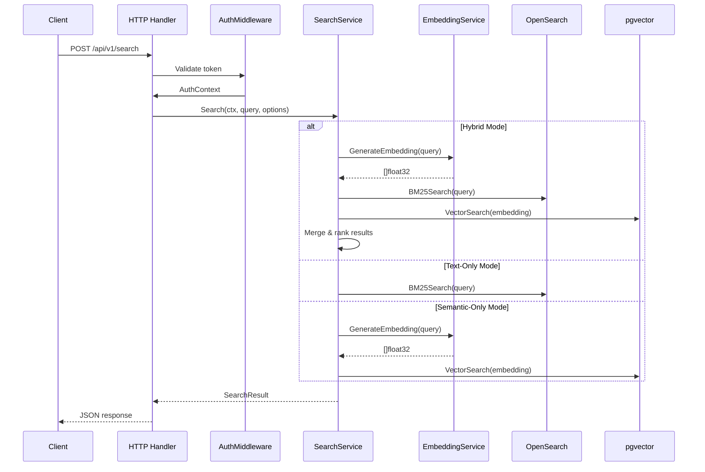
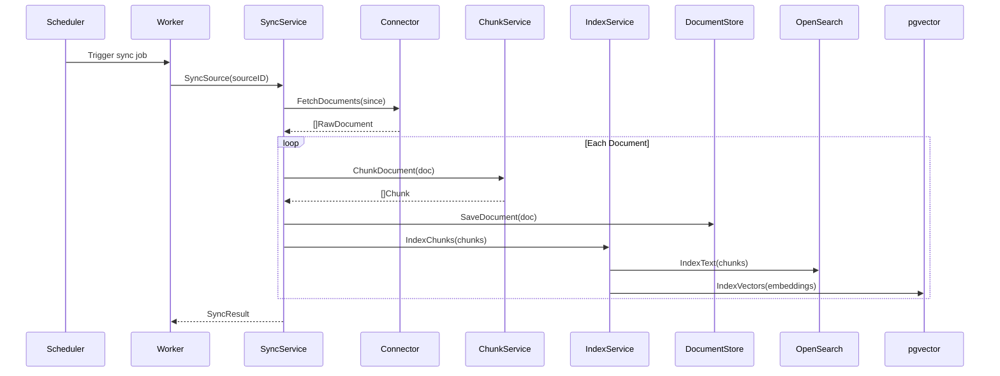
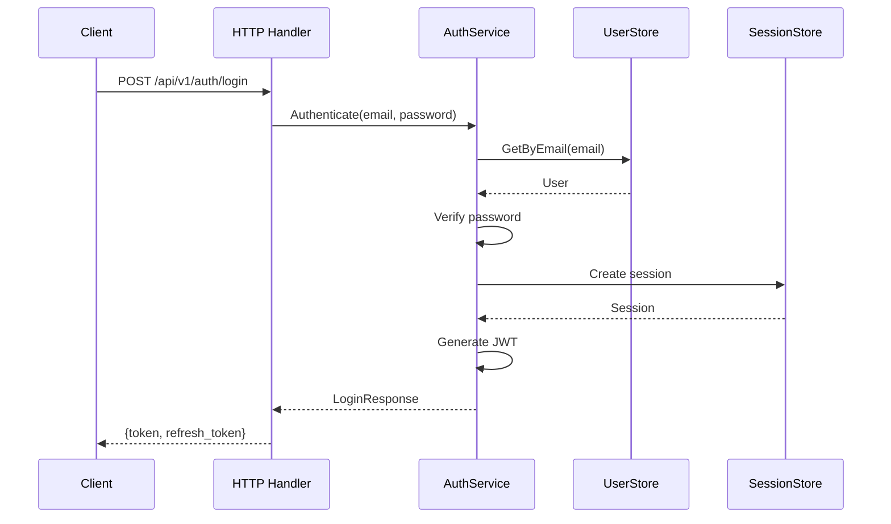

# Data Flow

This document describes how data flows through Sercha Core for the two primary operations: search and sync.

## Search Flow

When a user submits a search query:



### Search Modes

| Mode | When Used | Query Path |
|------|-----------|------------|
| `hybrid` | Both backends + embeddings available | OpenSearch BM25 + pgvector ANN |
| `text_only` | No embedding service or explicit | OpenSearch BM25 only |
| `semantic_only` | Explicit request with embeddings | pgvector ANN only |

## Sync Flow

When documents are synchronized from a source:



### Sync Stages

| Stage | Component | Action |
|-------|-----------|--------|
| 1. Fetch | Connector | Pull documents from source |
| 2. Normalize | Normalizer | Convert to standard format |
| 3. Chunk | ChunkService | Split into searchable units |
| 4. Store | DocumentStore | Persist metadata |
| 5. Index | IndexService | Add to search engine |

## Authentication Flow

Token-based authentication for API requests:



## Error Handling

Errors flow up through the layers with context:

```
Adapter Error → Domain Error → Service Error → HTTP Error
```

| Layer | Error Type | Example |
|-------|------------|---------|
| Adapter | Infrastructure error | `sql.ErrNoRows` |
| Domain | Business error | `ErrUserNotFound` |
| Service | Wrapped with context | `"failed to get user: not found"` |
| HTTP | Status code + message | `404 {"error": "user not found"}` |

## Next

- [Deployment Modes](./deployment-modes) - API and Worker separation
