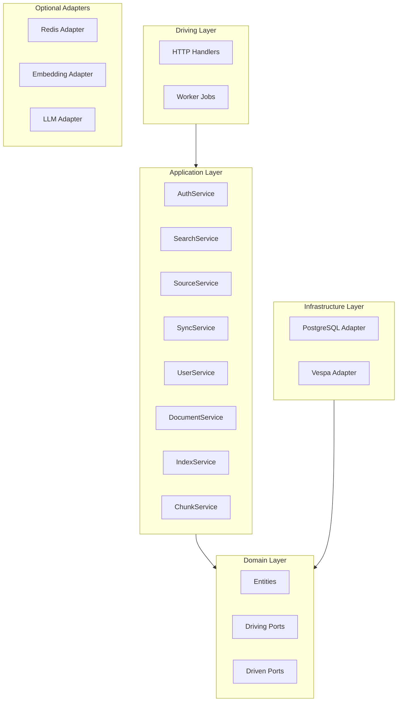

# System Layers

Sercha Core is organized into four distinct layers, each with specific responsibilities and dependency rules.

## Layer Overview



## Layer Details

### 1. Driving Layer (Adapters)

**Location:** `internal/adapters/driving/`

External interfaces that call into the application:

| Component | Purpose |
|-----------|---------|
| `http/` | REST API handlers, middleware, routing |
| `worker/` | Background job processing |

**Dependencies:** Can import from Application and Domain layers.

### 2. Application Layer (Services)

**Location:** `internal/core/services/`

Business logic orchestration:

| Service | Responsibility |
|---------|---------------|
| `AuthService` | Login, logout, token management |
| `SearchService` | Query execution, result ranking |
| `SourceService` | Data source CRUD and configuration |
| `SyncService` | Document synchronization |
| `UserService` | User management |
| `DocumentService` | Document CRUD |
| `IndexService` | Search index management |
| `ChunkService` | Document chunking |

**Dependencies:** Can import from Domain layer only.

### 3. Domain Layer (Core)

**Location:** `internal/core/domain/` and `internal/core/ports/`

Pure business entities and interface definitions:

| Component | Contents |
|-----------|----------|
| `domain/` | User, Document, Source, Chunk, Session, etc. |
| `ports/driving/` | Service interfaces |
| `ports/driven/` | Infrastructure interfaces |

**Dependencies:** No external imports (pure Go only).

### 4. Infrastructure Layer (Driven Adapters)

**Location:** `internal/adapters/driven/`

External system integrations:

**Required:**

| Adapter | Implements |
|---------|------------|
| `postgres/` | UserStore, DocumentStore, SourceStore, SessionStore, JobQueue |
| `vespa/` | SearchEngine |

**Optional:**

| Adapter | Implements |
|---------|------------|
| `redis/` | SessionStore, JobQueue (overrides PostgreSQL at scale) |
| `embedding/` | EmbeddingService |
| `llm/` | LLMService |

**Dependencies:** Can import from Domain layer only.

## Dependency Matrix

| Layer | Can Import From |
|-------|-----------------|
| Driving | Application, Domain |
| Application | Domain |
| Domain | Nothing (pure Go) |
| Infrastructure | Domain |

## Directory Structure

```
internal/
├── adapters/
│   ├── driving/
│   │   └── http/              # REST API
│   └── driven/
│       ├── postgres/          # Database adapter (required)
│       ├── vespa/             # Search adapter (required)
│       ├── redis/             # Cache/queue adapter (optional)
│       ├── embedding/         # Embedding adapter (optional)
│       └── llm/               # LLM adapter (optional)
├── core/
│   ├── domain/                # Entities and errors
│   ├── ports/
│   │   ├── driving/           # Service interfaces
│   │   └── driven/            # Infrastructure interfaces
│   └── services/              # Business logic
└── app/                       # Application container
```

## Next

- [Data Flow](./data-flow) - Request/response patterns
- [Deployment Modes](./deployment-modes) - Running API vs Worker
