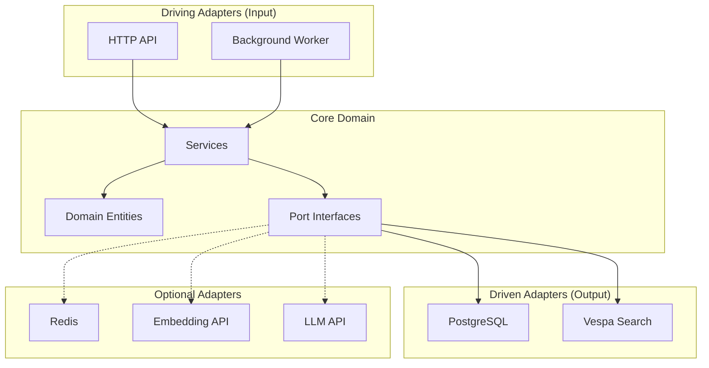

# Architecture Overview

Sercha Core uses **hexagonal architecture** (also known as ports and adapters) to achieve clean separation between business logic and infrastructure concerns.

## Why Hexagonal Architecture?

Sercha Core needs to:

1. **Support multiple data sources** - Google Drive, Dropbox, GitHub, local files, etc.
2. **Support multiple search backends** - Vespa today, potentially others tomorrow
3. **Support multiple embedding providers** - OpenAI, Ollama, or none at all
4. **Run in multiple modes** - API server, background worker, or combined

Hexagonal architecture makes these variations possible by isolating the core business logic from external dependencies.

## The Hexagon



## Key Concepts

### Driving Adapters (Input)

These call INTO the core domain:

| Adapter | Purpose |
|---------|---------|
| HTTP API | REST endpoints for clients |
| Background Worker | Job processing and sync scheduling |

### Core Domain

The heart of the system, containing:

| Component | Purpose |
|-----------|---------|
| **Domain Entities** | User, Document, Source, Chunk, Session |
| **Driving Ports** | Service interfaces (AuthService, SearchService, etc.) |
| **Driven Ports** | Infrastructure interfaces (UserStore, SearchEngine, etc.) |
| **Services** | Business logic implementation |

### Driven Adapters (Output)

These are called BY the core domain:

**Required:**

| Adapter | Purpose |
|---------|---------|
| PostgreSQL | User, document, source metadata, sessions, job queue |
| Vespa | Search engine (BM25 + vector) |

**Optional:**

| Adapter | Purpose |
|---------|---------|
| Redis | Session caching, job queue (improves performance at scale) |
| Embedding API | Semantic search - find documents by meaning |
| LLM API | Query expansion, summarization |

See [AI Models](../models/overview) for embedding and LLM configuration.

## Dependency Rule

Dependencies always point inward:

```
Adapters → Ports → Domain
```

- Adapters depend on ports (interfaces)
- Ports depend on domain entities
- Domain entities have no external dependencies

## Benefits

| Benefit | How It's Achieved |
|---------|-------------------|
| **Testability** | Mock adapters for unit tests |
| **Flexibility** | Swap adapters without changing core |
| **Maintainability** | Clear boundaries between concerns |
| **Graceful degradation** | Optional adapters (embedding) |

## Next

- [System Layers](./layers) - Detailed layer organization
- [Data Flow](./data-flow) - How requests flow through the system
- [Deployment Modes](./deployment-modes) - API, worker, and combined modes
