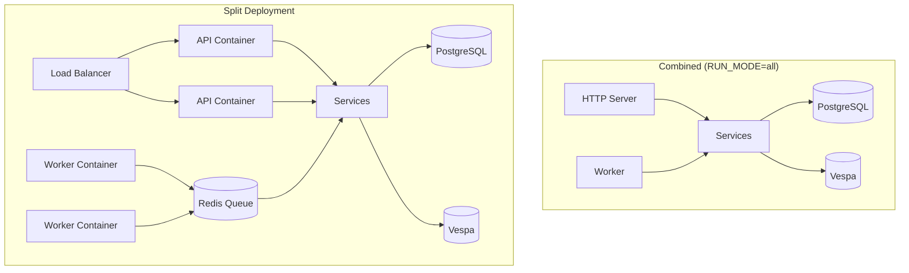

# Run Modes Overview

Sercha Core supports three run modes, enabling flexible deployment from single-container development to distributed production clusters.

## Mode Comparison

| Mode | HTTP Server | Task Queue | Scheduler | Use Case |
|------|-------------|------------|-----------|----------|
| `all` | Yes | Yes | Yes | Development, simple deployments |
| `api` | Yes | No | No | Horizontally scaled API tier |
| `worker` | No | Yes | Yes | Dedicated background processing |

## Configuration

Set the run mode via the `RUN_MODE` environment variable:

```yaml
services:
  sercha-api:
    image: sercha-core:latest
    environment:
      RUN_MODE: api
      # ... other config
```

| Value | Description |
|-------|-------------|
| `all` | Combined mode (default) |
| `api` | HTTP server only |
| `worker` | Background processing only |

## Architecture



## Shared Infrastructure

All containers connect to the same backing services:

| Service | Purpose | Required |
|---------|---------|----------|
| PostgreSQL | User data, documents, metadata | Yes |
| Vespa | Search index | Yes |
| Redis | Sessions, queue, distributed locks | No (falls back to PostgreSQL) |

## Graceful Shutdown

All modes respond to container stop signals:

1. Container runtime sends `SIGTERM`
2. In-flight requests complete (API) or current task finishes (Worker)
3. Connections drain within 30 seconds
4. Container exits cleanly

## Next Steps

- [Configuration](./configuration) - Environment variables reference
- [API Mode](./api-mode) - HTTP server configuration
- [Worker Mode](./worker-mode) - Task processing and scheduling
- [Scaling](./scaling) - Multi-instance deployment patterns
