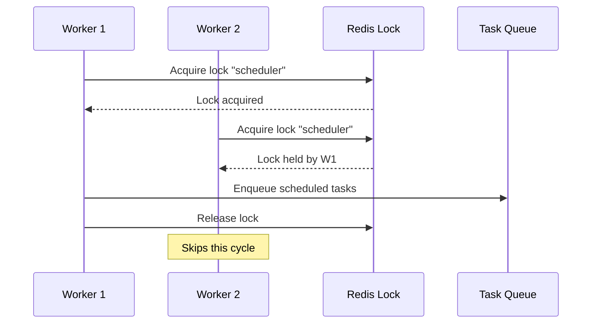

# Worker Mode

Worker mode runs background task processing and the scheduler, without the HTTP server. This is used for dedicated sync processing in scaled deployments.

## Configuration

```yaml
services:
  sercha-worker:
    image: sercha-core:latest
    environment:
      RUN_MODE: worker
      DATABASE_URL: postgres://...
      REDIS_URL: redis://...
      OPENSEARCH_URL: http://...
      PGVECTOR_URL: postgres://...
      JWT_SECRET: ${JWT_SECRET}
      MASTER_KEY: ${MASTER_KEY}
      WORKER_CONCURRENCY: 4
      SCHEDULER_ENABLED: "true"
      SCHEDULER_LOCK_REQUIRED: "true"
```

## What Runs

| Component | Status |
|-----------|--------|
| HTTP Server | No |
| Task Queue Consumer | Yes |
| Scheduler | Yes (if enabled) |
| Sync Orchestrator | Yes |

## Task Types

Workers process tasks from the queue:

| Task Type | Description |
|-----------|-------------|
| `sync_source` | Sync documents from a specific source |
| `sync_all` | Sync all enabled sources |

## Worker Settings

| Variable | Default | Description |
|----------|---------|-------------|
| `WORKER_CONCURRENCY` | `2` | Parallel task processors |
| `WORKER_DEQUEUE_TIMEOUT` | `5` | Seconds to wait when queue empty |

### Concurrency

Each worker container runs multiple goroutines that process tasks in parallel:

```
Worker Container
├── Task Processor 0
├── Task Processor 1
├── Task Processor 2
└── Task Processor 3
```

Set `WORKER_CONCURRENCY` based on available CPU and memory. Higher values increase throughput but consume more resources.

## Scheduler

The scheduler periodically checks for scheduled tasks and enqueues them.

| Variable | Default | Description |
|----------|---------|-------------|
| `SCHEDULER_ENABLED` | `true` | Enable scheduler |
| `SCHEDULER_LOCK_REQUIRED` | `true` | Require lock before scheduling |

### Distributed Locking

When running multiple worker containers, the scheduler uses distributed locking to prevent duplicate task creation:



**Lock behavior:**
- Lock key: `sercha:lock:scheduler`
- TTL: 60 seconds (auto-expires on crash)
- Implementation: Redis `SETNX` or PostgreSQL advisory locks

### Disabling the Scheduler

For deployments where only one worker should schedule:

```yaml
# Worker 1: Scheduler enabled
sercha-worker-scheduler:
  environment:
    RUN_MODE: worker
    SCHEDULER_ENABLED: "true"

# Workers 2-N: Scheduler disabled, only process tasks
sercha-worker:
  environment:
    RUN_MODE: worker
    SCHEDULER_ENABLED: "false"
  deploy:
    replicas: 3
```

## Task Queue

Workers consume tasks from a shared queue:

| Backend | When Used | Notes |
|---------|-----------|-------|
| Redis Streams | `REDIS_URL` is set | Recommended for multi-worker |
| PostgreSQL | `REDIS_URL` not set | Single-worker fallback |

### Redis Queue

Uses Redis Streams with consumer groups for reliable task delivery:
- Tasks are acknowledged after completion
- Failed tasks can be retried
- Multiple workers can consume from the same queue

### PostgreSQL Queue

Uses `FOR UPDATE SKIP LOCKED` for atomic task claiming:
- Suitable for single-worker deployments
- No external dependency on Redis

## Graceful Shutdown

When the container receives `SIGTERM`:

1. Stop accepting new tasks
2. Wait for in-progress tasks to complete (up to 10 seconds)
3. Release any held locks
4. Exit

## Key Source Files

| File | Description |
|------|-------------|
| `cmd/sercha-core/main.go` | Worker initialization |
| `internal/worker/worker.go` | Task queue consumer |
| `internal/core/services/scheduler.go` | Scheduled task management |
| `internal/core/services/sync.go` | Sync orchestration |
| `internal/adapters/driven/redis/lock.go` | Redis distributed lock |
| `internal/adapters/driven/postgres/lock.go` | PostgreSQL advisory lock |

## Next Steps

- [Scaling](./scaling) - Multi-instance deployment patterns
- [Configuration](./configuration) - Full environment variables reference
